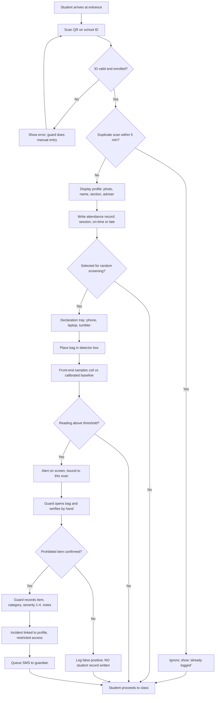
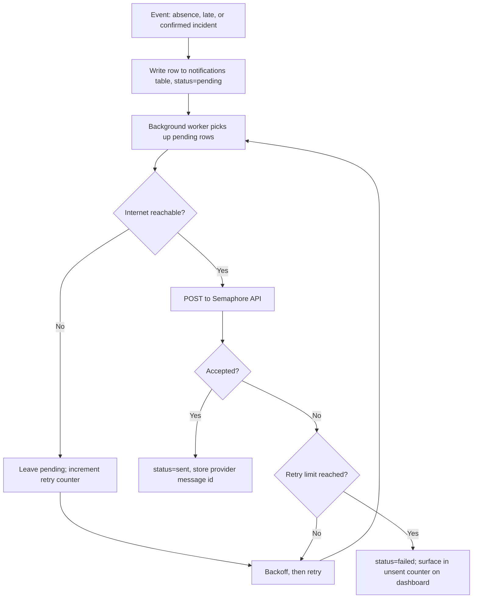
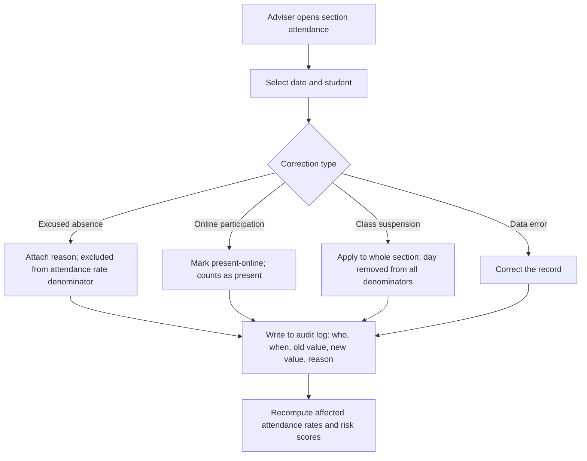
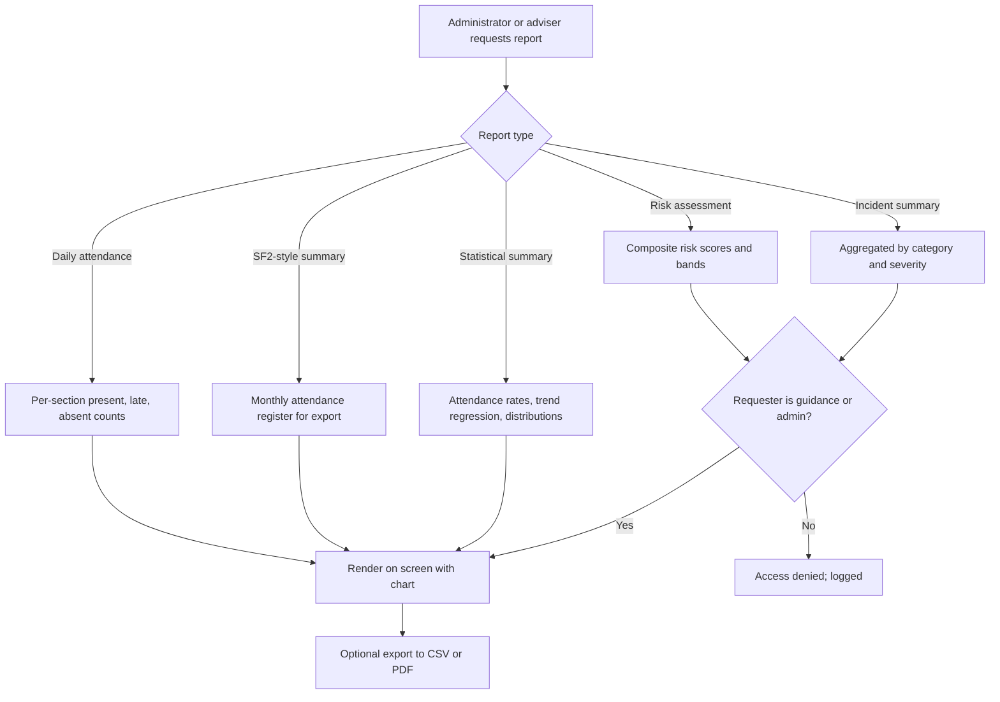

# TRACKIFY — System Flow

**Tracker for Real-time Attendance and Campus safety, Keeping Intelligent Feedback for Yielding reports**

This document describes the operational flow of TRACKIFY: what happens at the school entrance,
what gets recorded, who decides what, and how the system behaves when things go wrong.

Companion documents:

| Document | Covers |
|---|---|
| [hardware.md](hardware.md) | Raspberry Pi 5, the DIY coil detector box, wiring, safety, test protocol |
| [analytics-model.md](analytics-model.md) | Attendance rate, regression, AHP weighting, composite risk score |
| [sms-notifications.md](sms-notifications.md) | Semaphore SMS integration, queueing, message templates, privacy |
| [research-plan-review.md](research-plan-review.md) | Corrections needed in `RESEARCH-PLANCURRENT.docx` |

---

## 1. Actors

| Actor | Role in the system | Access level |
|---|---|---|
| **Student** | Scans ID, places bag in detector box when selected | Own attendance record only |
| **Guard / authorized personnel** | Operates the station, verifies alerts, opens bags, records confirmed incidents | Scan station + incident entry |
| **Class adviser** | Reviews section attendance, files corrections | Own section |
| **Guidance** | Reviews risk scores and incident history, initiates interventions | Assigned students |
| **Administrator** | Configures the system, manages accounts, exports reports | Full |
| **Parent / guardian** | Receives SMS notifications | Notifications only, no system login |

---

## 2. Governing design rules

These four rules constrain every flow in this document. They exist for legal and scientific
reasons, not convenience.

### Rule 1 — The sensor never writes to a student record

A detector reading is a **device event**. It is written to `screening_events`, which belongs to
the machine, not to a person. Only a **guard-confirmed** finding is written to `incidents` and
linked to a student.

*Why:* a coil detector cannot distinguish a knife from a laptop. Treating a reading as a
finding would attach false accusations to named minors. It would also invalidate the study —
you would be measuring the sensor, not prohibited items.

### Rule 2 — The scan arms the box

The detector is inert until a successful QR scan arms it. The reading that follows binds to
**that scan**, deterministically. There is no time-window correlation and no guessing about
whose bag it was.

If the box registers a reading while unarmed, it is an **unattributed reading**: logged to the
device log for diagnostics, never associated with any student.

### Rule 3 — Declare-first is mandatory

Before a bag enters the box, the student places phone, laptop/tablet, and metal tumbler in a
declaration tray — the same principle as airport security.

*Why:* essentially every school bag contains metal. Without the tray the box alarms on almost
every bag, guards learn to ignore it, and the system becomes worse than no system at all.
The tray is what makes a trigger *mean* something.

### Rule 4 — Screening is randomly sampled, not universal

Selection for screening is decided in software at scan time, at a configured rate.

*Why:* two reasons. It matches the "surprise inspections" basis in the research plan, and it
resolves throughput — at roughly 8–10 seconds of handling per bag, screening every student
would require multiple lanes or a much longer entry window. The selection rate is a logged
configuration parameter so it can be reported in results.

---

## 3. Main flow — student entry

### Step narrative

| # | Node | What happens |
|---|---|---|
| 1 | **A** | Student arrives during the entry window for the current session. |
| 2 | **B** | A webcam reads the QR on the school ID; the student sees a live preview with an aiming frame. A USB HID scanner is accepted on the same code path. |
| 3 | **C** | System resolves the code to an enrolled student. Unknown, expired, or damaged codes fall to manual entry (§5.1). |
| 4 | **D** | Scans within the debounce window are ignored, so a student who rescans is not double-counted. |
| 5 | **E** | Profile appears for visual identity confirmation by the guard — photo, name, section, adviser. |
| 6 | **F** | Attendance is written immediately, before screening. Screening outcome must never affect whether attendance was recorded. |
| 7 | **G** | Random-selection gate (Rule 4). Not selected → student proceeds. |
| 8 | **H** | Declaration tray (Rule 3). Declared items are noted on the screening event but not inspected further. |
| 9 | **I–J** | Bag placed in the box. Front-end microcontroller samples the coil and compares against the rolling baseline. See [hardware.md](hardware.md). |
| 10 | **K** | Reading compared against the calibrated threshold. Below → student proceeds; the event is still logged for the false-negative analysis. |
| 11 | **L** | Alert shown on the station screen, bound to the arming scan (Rule 2). |
| 12 | **M** | **Human verification.** The guard physically opens the bag. The system makes no determination here. |
| 13 | **N** | Guard's decision is the record of truth. Not confirmed → logged as false positive against the *device*, nothing written to the student (Rule 1). |
| 14 | **O** | Guard records the item, category, severity tier 1–4, and free-text notes. Guard identity is captured in the audit log. |
| 15 | **P** | Incident links to the student profile under restricted access — guidance and administrators only. |
| 16 | **Q** | Notification queued (not sent inline — see §4.1) so a slow network never blocks the entrance queue. |

---

## 4. Sub-flows

### 4.1 Notification queue

Notifications are **queued locally and sent by a background worker.** Nothing in the entry
flow waits on the network.

Because the SMS transport is API-only, **the internet is a single point of failure.** The queue
is what contains that risk: a WiFi outage delays notifications, it never silently loses them.
The station dashboard shows a persistent **unsent count** so a sustained outage is visible to
staff rather than discovered later. Details in [sms-notifications.md](sms-notifications.md).

### 4.2 Attendance correction

Required by research question 1 — editable reports for excused absences, online participation,
and class suspensions.

Original scan records are **never overwritten.** A correction is a new row that supersedes the
original; both remain, and the audit log preserves the chain. This protects the integrity of
the comparison against manually recorded attendance in Phase III.

### 4.3 Reporting

Risk scores and incident data are access-controlled. A denied attempt is itself logged.
Computation is specified in [analytics-model.md](analytics-model.md).

---

## 5. Exception paths

Every branch below has a defined outcome. Nothing terminates undefined.

| # | Condition | System behaviour | Record written |
|---|---|---|---|
| 5.1 | **Unregistered / damaged / unreadable QR** | Error on screen; guard enters student manually by name or LRN | `attendance_logs` with `method=manual`, guard ID captured |
| 5.2 | **Duplicate scan inside debounce window** | "Already logged" shown; no new record | None |
| 5.3 | **Scan outside any session window** | Recorded against nearest session, flagged `out_of_window` for adviser review | `attendance_logs` flagged |
| 5.4 | **Scan after late threshold** | Attendance recorded as `late`; late notification queued | `attendance_logs` with `status=late` |
| 5.5 | **No scan at all for the day** | End-of-session job marks absent; absence notification queued | `attendance_logs` with `status=absent`, `method=derived` |
| 5.6 | **Box reads while unarmed** | Unattributed reading; diagnostic only | Device log only — never a student |
| 5.7 | **Alert not confirmed by guard** | False positive recorded against the device | `screening_events` with `outcome=false_positive` |
| 5.8 | **Guard overrides an alert without opening the bag** | Permitted but requires a reason; flagged for supervisor review | `screening_events` with `outcome=overridden` + reason + guard ID |
| 5.9 | **Detector offline or uncalibrated** | Screening gate disabled entirely; attendance continues normally | Device status logged; screening rate reported as 0 for the period |
| 5.10 | **Network loss** | Attendance and incidents continue writing locally; notifications queue | Notifications stay `pending` |
| 5.11 | **SMS send fails past retry limit** | Marked failed; unsent counter increments on dashboard | `notifications` with `status=failed` |
| 5.12 | **Power loss mid-session** | RTC preserves correct timestamps; local DB replays on boot; partial scan discarded | Recovery event in audit log |
| 5.13 | **Two students scan in rapid succession at one lane** | Second scan re-arms the box and supersedes the first arming; the superseded arming is voided, not attributed | Voided arming logged |

---

## 6. Records written

Compact field reference. Full schema belongs with the implementation; this is what the flow
above needs to exist.

### `students`
`id` · `lrn` · `qr_code` · `full_name` · `grade_level` · `section` · `adviser_id` ·
`guardian_name` · `guardian_mobile` · `photo_path` · `consent_on_file` · `active`

### `attendance_logs`
`id` · `student_id` · `date` · `session` (AM/PM) · `scanned_at` ·
`status` (present / late / absent / excused / online) · `method` (scan / manual / derived) ·
`recorded_by` · `flags` · `superseded_by`

### `screening_events`
`id` · `attendance_log_id` (the arming scan) · `occurred_at` · `reading_strength` ·
`baseline_value` · `threshold` · `triggered` (bool) · `declared_items` ·
`outcome` (clear / false_positive / confirmed / overridden) · `override_reason` · `operator_id`

> Note: this table has no direct `student_id`. Attribution flows only through the arming scan,
> which enforces Rule 2 structurally rather than by convention.

### `incidents`
`id` · `student_id` · `screening_event_id` · `occurred_at` · `item_description` ·
`category` · `severity` (1–4) · `notes` · `confirmed_by` · `visibility` (restricted)

### `notifications`
`id` · `student_id` · `trigger_type` · `recipient_mobile` · `message_body` ·
`status` (pending / sent / failed) · `retry_count` · `provider_message_id` ·
`queued_at` · `sent_at`

### `audit_log`
`id` · `actor_id` · `action` · `entity_type` · `entity_id` · `old_value` · `new_value` ·
`reason` · `occurred_at` · `ip_or_station`

---

## 7. Requirements traceability

Mapping each feature in research question 1 of the research plan to where it lives in this flow.

| Research plan requirement (§B) | Where it is handled |
|---|---|
| QR code-based school identification for attendance | §3 steps 2–5 |
| Real-time and automated attendance logging and reporting | §3 step 6; §4.3 |
| Recording of verified prohibited-item incidents in the student's profile | §3 steps 12–15; Rule 1 |
| SMS notifications to parents/guardians | §3 step 16; §4.1 |
| Statistical summary of attendance data | §4.3; [analytics-model.md](analytics-model.md) |
| Editable reports for excused absence, online participation, class suspension | §4.2 |

---

## 8. Privacy and access

- An incident record naming a minor and describing a prohibited item is **sensitive personal
  information** under RA 10173 (Data Privacy Act of 2012). It is not ordinary attendance data
  and must not be displayed on any shared or public-facing screen.
- The station screen shows only what the guard needs at that moment — current student, current
  result. It never shows history, risk score, or prior incidents.
- Risk scores are visible to **guidance and administrators only.**
- Guardian mobile numbers are transmitted to a third-party SMS provider. This must be disclosed
  in the consent form and in §F of the research plan — see
  [research-plan-review.md](research-plan-review.md), item 8.
- Parental consent and student assent must be on file before a student is enrolled in the
  system. `students.consent_on_file` gates participation.
- A data retention period must be set and enforced. Incident records should not outlive the
  student's enrolment without a documented reason.
