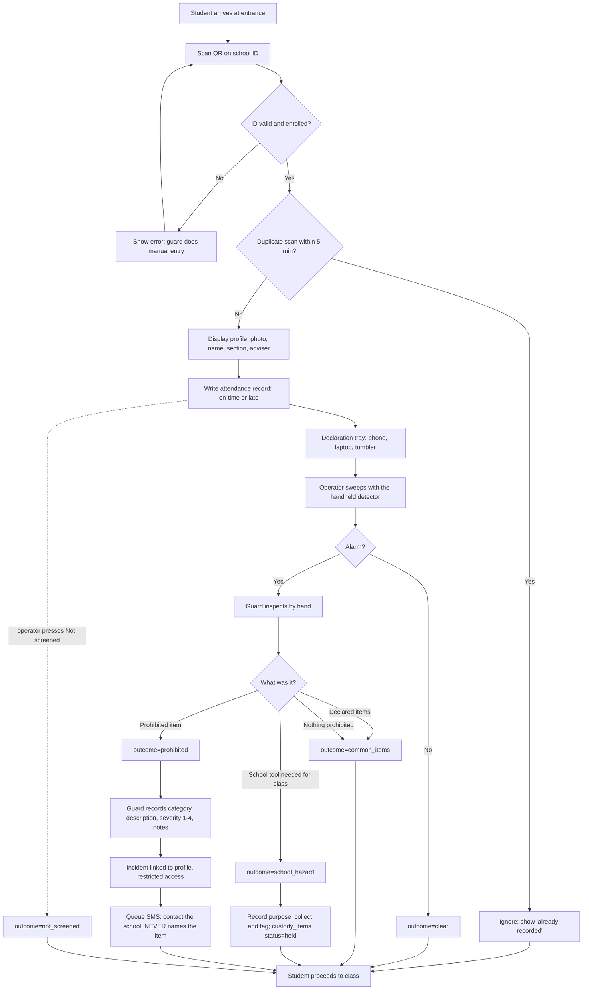
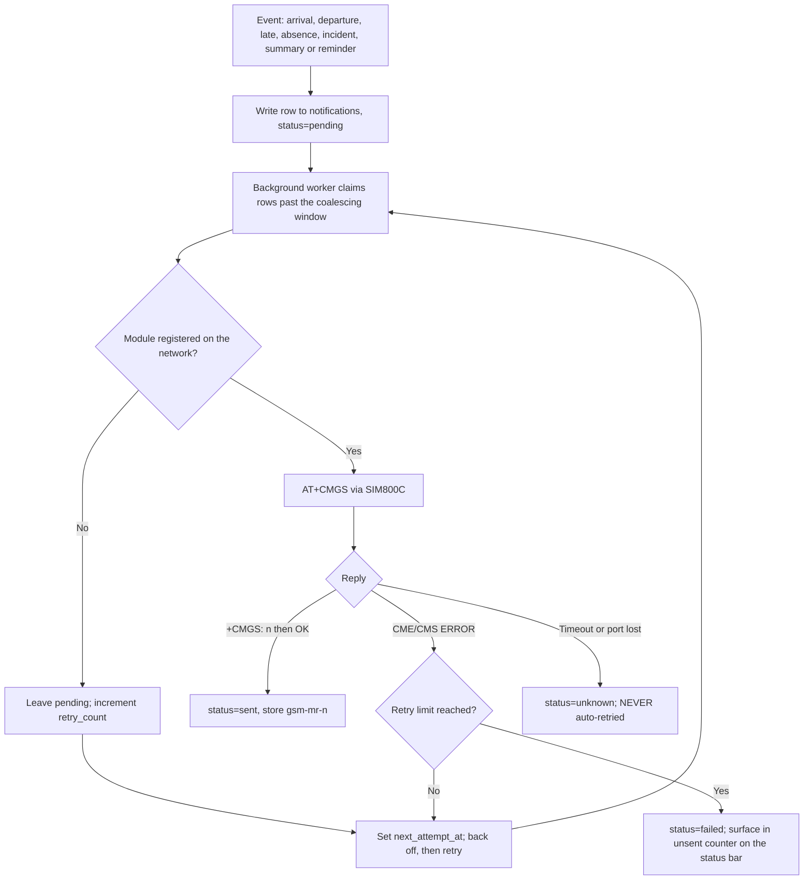
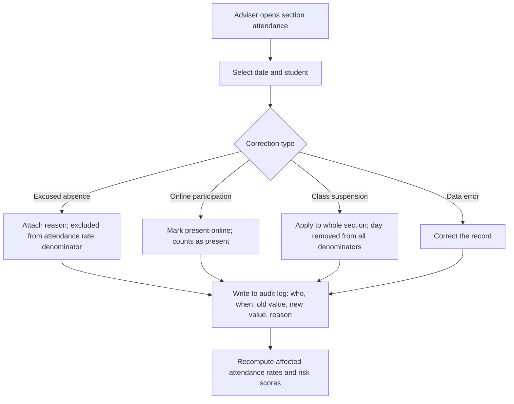
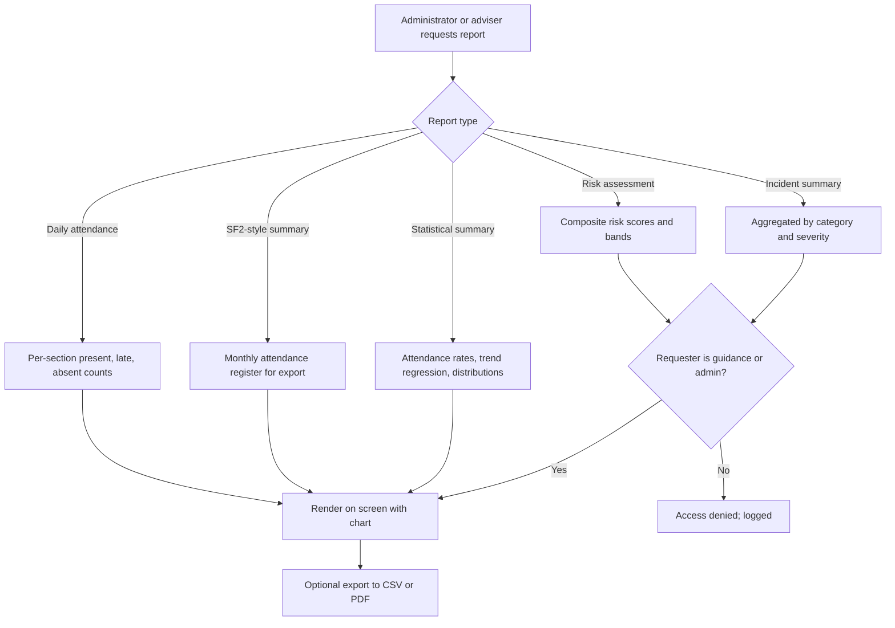

# TRACKIFY — System Flow

**Tracker for Real-time Attendance and Campus safety, Keeping Intelligent Feedback for Yielding reports**

This document describes the operational flow of TRACKIFY: what happens at the school entrance,
what gets recorded, who decides what, and how the system behaves when things go wrong.

Companion documents:

| Document | Covers |
|---|---|
| [TDD.md](TDD.md) | Technical Design Document — architecture, data model, module map, interfaces |
| [prohibited-items.md](prohibited-items.md) | Screening at the gate: outcomes, incidents, custody, why incidents are not weighted |
| [personel-access.md](personel-access.md) | The records screen: password gate, corrections, roster import, exports |
| [hardware.md](hardware.md) | Raspberry Pi 5, camera and GSM bring-up. Its detector sections describe hardware the project no longer builds |
| [analytics-model.md](analytics-model.md) | Attendance rate, regression, AHP weighting, composite risk score |
| [sms-notifications.md](sms-notifications.md) | GSM-module SMS transport, queueing, message templates, privacy |
| [research-plan-review.md](research-plan-review.md) | Corrections needed in `RESEARCH-PLANCURRENT.docx` |

---

## 1. Actors

| Actor | Role in the system | Access level |
|---|---|---|
| **Student** | Scans ID, places bag in detector box when selected | Own attendance record only |
| **Guard / authorized personnel** | Operates the station, verifies alerts, opens bags, records confirmed incidents | Scan station + incident entry |
| **Class adviser** | Reviews section attendance, files corrections | Own section |
| **Guidance** | Reviews risk scores and incident history, initiates interventions | Assigned students |
| **Administrator** | Configures the system, manages accounts, exports reports | Full |
| **Parent / guardian** | Receives SMS notifications | Notifications only, no system login |

---

## 2. Governing design rules

These four rules constrain every flow in this document. They exist for legal and scientific
reasons, not convenience.

### Rule 1 — The device never writes to a student record

The **metal detector is a separate device** — a handheld wand or walk-through unit operated by a
person. TRACKIFY is not wired to it and cannot see its output. What the system records is the
**operator's judgement**: an alarm they observed, and what their inspection concluded.

Only a **guard-confirmed** finding is written to `incidents` and linked to a student. A
screening that came back clear attaches nothing to anyone.

*Why:* a metal detector cannot distinguish a knife from a laptop. Treating an alarm as a finding
would attach false accusations to named minors, and would invalidate the study — you would be
measuring the device, not prohibited items.

> Originally this rule guarded against a coil sensor writing directly to a record. With a
> separate device it holds **by construction**: there is no sensor input to mistake for a
> finding, because every value in `screening_events` is a human judgement with a name attached.
> See [prohibited-items.md](prohibited-items.md) §1.

### Rule 2 — The scan binds the screening

A screening record cannot exist without the scan that preceded it. `screening_events` has **no
`student_id` column**: attribution flows only through `scan_event_id`, so there is no
time-window correlation and no guessing about whose bag it was.

A screening performed with no scan is not recorded against anyone. It cannot be — the schema has
nowhere to put it.

### Rule 3 — Declare-first is mandatory

Before screening, the student places phone, laptop/tablet, and metal tumbler in a declaration
tray — the same principle as airport security.

*Why:* essentially every school bag contains metal. Without the tray the detector alarms on
almost every student, guards learn to ignore it, and the system becomes worse than no system at
all. The tray is what makes an alarm *mean* something.

**With universal screening (Rule 4) this stops being advisory and becomes load-bearing
arithmetic.** Without the tray, the guard inspects nearly every bag at 30 s each and 200 students
cannot pass in a 30-minute window at all. With it, ~5 s each fits one lane with no slack. See
[prohibited-items.md](prohibited-items.md) §2.

### Rule 4 — Every student is screened

Every student who scans in is screened, and the outcome is recorded — **including the clears.**

*Why the change:* this rule previously specified a random sample, because the coil box handled
one bag at a time at 8–10 seconds each. A handheld device sweeping a student who has already
emptied their pockets is fast enough to do everyone, given the declaration tray and, realistically,
two lanes.

*Why the clears are recorded:* now that the detector is not ours, the **confirmation rate** —
what fraction of alarms turned out to be a phone — is the only false-positive measure the study
can still report, and it needs every clear screening as its denominator.

*And what is never recorded:* if nobody screens a student, the outcome is **`not_screened`**,
never `clear`. A system that recorded a clear because a timer expired would be asserting that a
guard checked a bag when nobody did.

---

## 3. Main flow — student entry

### Step narrative

| # | Node | What happens |
|---|---|---|
| 1 | **A** | Student arrives during the entry window for the current session. |
| 2 | **B** | A webcam reads the QR on the school ID; the student sees a live preview with an aiming frame. A USB HID scanner is accepted on the same code path. |
| 3 | **C** | System resolves the code to an enrolled student. Unknown, expired, or damaged codes fall to manual entry (§5.1). |
| 4 | **D** | Scans within the debounce window are ignored, so a student who rescans is not double-counted. |
| 5 | **E** | Profile appears for visual identity confirmation by the guard — photo, name, section, adviser. The HMAC proves the *code* is genuine; only a face proves the *person* holding it is, which is the control against proxy attendance. A student with no photo on file falls back to initials rather than an empty frame. |
| 6 | **F** | **Attendance is written immediately, before screening.** Screening outcome must never affect whether attendance was recorded — this is the rule that must not bend, and it is why the screening panel appears only after the attendance row is committed. |
| 7 | **G** | Declaration tray (Rule 3). Declared items are noted on the screening event but not inspected further. |
| 8 | **H** | The operator sweeps with the **separate handheld detector**. TRACKIFY is not wired to it and records only what the operator observed. |
| 9 | **I** | No alarm → `clear`, recorded rather than discarded: it is the denominator of the confirmation rate (§Rule 4). |
| 10 | **J** | **Human verification.** The guard inspects by hand. The system makes no determination here and never has. |
| 11 | **K** | The guard's decision is the record of truth. An alarm explained by the tray is `common_items` — logged against the *procedure*, nothing written to the student (Rule 1). |
| 12 | **L** | A school tool the student needs — scissors for art, a cutter for TLE. Purpose recorded at the gate, item tagged and collected. See [prohibited-items.md](prohibited-items.md) §7. |
| 13 | **M–N** | Category from the five disjoint options, **mandatory** free-text description, severity 1–4 defaulted from the category. A changed severity requires a reason. Guard identity is captured in the audit log. |
| 14 | **O** | Incident links to the student profile under restricted access — guidance and administrators only. |
| 15 | **P** | Notification queued (not sent inline — see §4.1) so a slow transmission never blocks the entrance queue. A 2G submit takes ~14 seconds. **The body never names the item** — see §8. |
| 16 | **Y** | If nobody screens the student, the operator presses **Not screened**. The screen never closes on its own, so no outcome is ever recorded that a person did not choose. |

---

## 4. Sub-flows

### 4.1 Notification queue

Notifications are **queued locally and sent by a background worker.** Nothing in the entry
flow waits on the network.

**The transport changed during the build.** This flow was first written against an HTTP SMS
API, where the internet was the single point of failure. It now runs on a SIM800C GSM module
over USB serial — the reasoning, and the trade-offs accepted, are recorded in
[sms-notifications.md](sms-notifications.md) §1. Three consequences belong here:

- **The failure is no longer the internet.** It is 2G coverage, SIM registration, and the
  module's power supply. Nothing in the notification path touches a network the school
  controls, so a WiFi outage no longer delays a single message.
- **A send can now be genuinely ambiguous.** If the module goes silent after the message body
  is written, it may or may not have been submitted. Those rows become `unknown` and are
  **never re-sent automatically** — for SMS, at-most-once is the correct bias, because a
  missed text is recoverable and a duplicate erodes a parent's trust in the system. There is no
  provider dashboard to reconcile against, so a human decides.
- **Retries are spaced, not immediate.** A failed row records `next_attempt_at` and is skipped
  until then. Without that, the worker's four-second poll would spend the entire retry
  allowance inside twenty seconds and permanently fail a message that a minute's patience
  would have delivered.
- **The module can simply be absent, and that is not a failed message.** A cable that is not
  plugged in, or a serial port that is not the module, means nothing was attempted. The
  station never starts a drain in that state: rows stay `pending` with their retry budget
  untouched, and go out on the first pass after the module answers. Draining into an absent
  module instead would run every queued notification through the backoff ladder, which
  reaches the retry limit in under two hours — the morning's notifications would be
  permanently `failed` by mid-morning, and plugging the module in at noon would send nothing.

The queue still contains the same risk it always did: an outage **delays** notifications, it
never silently loses them. The station shows a persistent **unsent count** so a sustained
failure is visible the same morning rather than discovered in the data afterwards.

**The station always starts.** The notification module is checked at the point of use, never
as a precondition for opening the scan station — a school morning cannot depend on a USB
cable. When the module is missing or not answering, the status bar reads `SMS: gsm
unavailable` in amber with the reason on hover, alongside the same treatment a dead camera
gets. The alternative failed badly in both directions: a hard error meant no screen at all,
and on a machine with any serial port present (on Windows, usually Bluetooth) the module was
assumed healthy while every send timed out silently.

### 4.2 Attendance correction

Required by research question 1 — editable reports for excused absences, online participation,
and class suspensions.

Original scan records are **never overwritten.** A correction is a new row that supersedes the
original; both remain, and the audit log preserves the chain. This protects the integrity of
the comparison against manually recorded attendance in Phase III.

**Built.** Staff reach this through a password-gated page on the kiosk — see
[personel-access.md](personel-access.md) for the correction types, the supersede sequence, the
edit log, and the two register exports — the working XLSX register and the DepEd SF2. Two things
about it belong here:

- **Access is by one shared password, so the log records *what* changed but not *who*.** A typed
  name accompanies every correction and is stored in `corrected_by_name`; `corrected_by`, the
  foreign key to a real account, stays NULL until individual logins exist. The distinction is
  deliberate — a typed name is a claim, and storing it as an identity would overstate what the
  audit trail can support.
- **Class suspension is applied per student**, not by a flag on the day, because `school_days`
  is keyed by date alone and has no section column.

### 4.3 Reporting

Risk scores and incident data are access-controlled. A denied attempt is itself logged.
Computation is specified in [analytics-model.md](analytics-model.md).

---

## 5. Exception paths

Every branch below has a defined outcome. Nothing terminates undefined.

| # | Condition | System behaviour | Record written |
|---|---|---|---|
| 5.1 | **Unregistered / damaged / unreadable QR** | Error on screen; guard enters student manually by name or LRN | `scan_events` with `method=manual`, operator id captured |
| 5.2 | **Duplicate scan inside debounce window** | "Already recorded at 7:12 AM" shown; no new record. The window spans **both directions**, so a student re-tapping to check it registered cannot record a departure | None |
| 5.3 | **Scan before the gate opens** | Recorded normally, flagged `out_of_window` for adviser review | `attendance_days.flags` |
| 5.4 | **Scan after late threshold** | Attendance recorded as `late`; late notification queued instead of the arrival one, never both | `attendance_days` with `status=late` |
| 5.4b | **Authorised re-entry after the student already departed** | Needs a supervisor override. The day keeps the status its FIRST arrival earned — lateness is decided once — and the guardian gets a plain arrival text, never a second `late` one. Recomputing the status against the clock would have rewritten a 06:50 arrival as `late` at 3pm and texted the parent to say so | `scan_events` with `override_reason`; the existing `attendance_days` row gains flag `re_entry`, status unchanged |
| 5.5 | **No scan at all for the day** | The end-of-day job marks absent and queues the absence notification. It runs from the kiosk on the first clock tick past `dismissal_time`, and is refused outright on a suspended day — closing a day with no classes would otherwise mark the whole roster absent and text every guardian | `attendance_days` with `status=absent`, `flags=derived` and no linked scan |
| 5.6 | **Nobody screens the student** | The operator presses **Not screened**. There is no timeout and no automatic outcome at all, so an unscreened student is recorded as such only because a person said so | `screening_events` with `outcome=not_screened` |
| 5.6b | **A scan arrives before the previous screening is answered** | Refused, with the waiting student named on screen. The refusal writes **nothing** — no scan, no attendance, no notification — so the student rescans normally once the screen is free | None |
| 5.7 | **Alarm not confirmed by inspection** | Recorded against the *procedure*; nothing written to the student (Rule 1). This is the numerator the confirmation rate needs | `screening_events` with `outcome=clear` or `common_items` |
| 5.8 | **Guard passes a student without inspecting** | Permitted but requires a reason; flagged for supervisor review | `screening_events` with `outcome=overridden` + reason + operator id |
| 5.8b | **Inspection started but not finished** | Not a category and not a finding — an unfinished job. Surfaces for the guard until it resolves to a real outcome | `screening_events` with `outcome=pending_verification` |
| 5.9 | **Detector unavailable or out of battery** | Attendance continues normally; screenings record as `not_screened` and coverage for the period drops visibly rather than silently | `screening_events` with `outcome=not_screened` |
| 5.9b | **Collected item cannot be found in storage** | The custody chain is the school's entire account of what happened to it: who collected it, the `storage_ref` it was tagged with, who released it and to whom | `custody_items` + `audit_log` |
| 5.10 | **Mobile network loss** | Attendance continues writing locally; notifications queue and back off. The school's internet is not in this path at all | Notifications stay `pending` with `next_attempt_at` set |
| 5.11 | **SMS send fails past retry limit** | Retried on the configured backoff ladder, then marked failed; unsent counter increments | `notifications` with `status=failed` |
| 5.11b | **Module goes silent mid-send** | Delivery is unknowable: the message may already be with the SMSC. Parked for a human, never auto-resent | `notifications` with `status=unknown` |
| 5.12 | **Power loss mid-session** | RTC preserves correct timestamps; local DB replays on boot; partial scan discarded | Recovery event in audit log |
| 5.13 | **Two students scan in rapid succession at one lane** | The screening binds to the scan, and a scan can carry only one screening. The second scan opens a new screening; the first, if unanswered, stays `not_screened` rather than absorbing the second student's result | `screening_events`, one per scan |

---

## 6. Records written

Compact field reference. Full schema belongs with the implementation; this is what the flow
above needs to exist.

### `students`
`id` · `lrn` · `first_name` · `last_name` · `section_id` · `guardian_name` ·
`guardian_mobile` · `photo_path` · `consent_on_file` · `notify_optin` · `active`

> The QR payload is **not stored.** It is derived as a pure function of
> `(lrn, secret)`, so there is nothing to drift out of sync and nothing to leak from
> the database. `sections` carries `adviser_id`.
>
> It is keyed on the **LRN, not `id`.** A printed card is a physical object that outlives
> any particular database, and the LRN follows the learner for life; keyed on the
> autoincrement `id`, a reseed would renumber every student and silently invalidate every
> card already handed out. The scan path resolves LRN → row and then uses that row's own
> `id` for every write, because all the foreign keys below point at `students(id)`.

### `scan_events` — what the sensor saw

`id` · `student_id` · `scanned_at` · `date` · `direction` (in / out) ·
`method` (scan / manual) · `raw_payload` · `operator_id` · `override_reason`

**Append only.** Never updated, never deleted.

### `attendance_days` — what the day means

`id` · `student_id` · `date` · `entry_scan_id` · `exit_scan_id` ·
`status` (present / late / absent / excused / online) · `flags` · `minutes_on_campus` ·
`superseded_by` · `corrected_by` · `corrected_by_name` · `correction_reason` ·
`correction_type` · `created_at`

`corrected_by_name` carries the typed, **unverified** name: one shared password cannot prove
who, so `corrected_by` stays NULL and the claim is recorded as a claim. See §4.2.

> **Why two tables and not one.** §4.2 requires that an original record is never overwritten
> and that a correction supersedes it. One table cannot hold both an immutable observation and
> an editable interpretation of it. Splitting them makes that rule structural rather than a
> convention someone has to remember: a scan is a fact about a moment, a school day is a
> judgement about a person, and only the second is ever edited. It also means "the guard
> corrected this" and "the sensor read this" can never be confused in the Phase III comparison
> against manually recorded attendance.
>
> AM/PM sessions were replaced by **one in/out pair per day**, which is what the scan station
> actually records. `minutes_on_campus` is derived from the pair.
>
> A derived absence has no scan to point at, so it carries `flags = derived` rather than a
> `method` — `method` belongs to a scan, and an absence is precisely the absence of one.

### `screening_events`

`id` · `scan_event_id` · `occurred_at` · `metal_detected` · `outcome` ·
`declared_items` · `override_reason` · `notes` · `operator_id`

`outcome` ∈ `clear` · `common_items` · `prohibited` · `school_hazard` ·
`pending_verification` · `not_screened` · `overridden`

> **No direct `student_id`, deliberately.** Attribution flows only through the arming scan,
> which enforces Rule 2 structurally rather than by convention. The sensor columns the original
> design carried — `reading_strength`, `baseline_value`, `threshold` — are gone: the detector is
> a separate device and there is no reading to store. What replaces them is `metal_detected`,
> which is not a measurement but an observation by a named person.

### `incidents`

`id` · `student_id` · `screening_event_id` · `occurred_at` · `category` ·
`item_description` **NOT NULL** · `severity` (1–4) · `severity_reason` · `notes` ·
`confirmed_by` · `visibility` (restricted)

`category` ∈ `bladed` · `blunt` · `pointed` · `tool` · `other` — five, disjoint, keyed on what
makes the object dangerous. See [prohibited-items.md](prohibited-items.md) §6 for the decision
rule and why an overlapping list would have made the category counts unusable.

### `custody_items`

`id` · `student_id` · `screening_event_id` · `item_description` · `category` · `purpose` ·
`storage_ref` · `status` · `collected_at` · `collected_by` · `released_at` · `released_to` ·
`release_reason` · `released_unbacked` · `returned_at` · `returned_to`

> School tools — scissors, cutters, compasses — held at the gate and released to the adviser for
> the class that needs them. `storage_ref` is the physical tag: without it, `held` does not tell
> anyone *where the item is*.

### `hazard_requests`

`id` · `section_id` · `date` · `subject` · `item_type` · `notes` · `requested_by` · `created_at`

> A teacher declaring in advance that a section needs those tools, which is what makes a release
> an expected event rather than a judgement call at the cupboard.

### `notifications`
`id` · `student_id` · `guardian_mobile` ·
`trigger` (arrival / departure / late / absent / incident / summary / reminder) ·
`idempotency_key` **unique** · `body` · `status` · `retry_count` · `provider_message_id` ·
`coalesce_group` · `last_error` · `event_at` · `queued_at` · `claimed_at` ·
`next_attempt_at` · `sent_at`

`status` ∈ `pending` · `sending` · `sent` · `failed` · `unknown` · `suppressed`

> Three of those statuses exist for reasons worth stating. `sending` plus `idempotency_key` is
> what survives a worker crash without texting a parent twice. `unknown` is the parked pile
> from 5.11b. `suppressed` is a message the system deliberately refused to send — a station
> that is not live (`SMS_LIVE=false`), or the spend circuit breaker — and it is recorded
> rather than dropped, so nobody later mistakes a policy decision for a delivery failure.
>
> `event_at` is when the scan happened; `queued_at` is when the row was written. Coalescing
> groups on the former, so a morning outage flushing at 4pm cannot merge a 7am arrival with a
> 4pm departure into one nonsensical message.

### `audit_log`
`id` · `actor_id` · `actor_name` · `action` · `entity_type` · `entity_id` · `old_value` ·
`new_value` · `reason` · `occurred_at`

> A station identifier belongs here once there is more than one station — that is a V2
> concern, and V1 is a single kiosk on one machine. The table exists and is written by
> `db.audit()` from corrections, roster imports, screening amendments and every custody
> transition. `actor_id` is usually NULL and `actor_name` holds a typed, unverified claim,
> because one shared password authenticates a role rather than a person.

---

## 7. Requirements traceability

Mapping each feature in research question 1 of the research plan to where it lives in this flow.

| Research plan requirement (§B) | Where it is handled | V1 status |
|---|---|---|
| QR code-based school identification for attendance | §3 steps 2–5 | Built |
| Real-time and automated attendance logging | §3 step 6; §5.5 | Built |
| Automated attendance **reporting** | §4.3; [personel-access.md](personel-access.md) | Built — the working section register as XLSX, **the DepEd School Form 2 itself** to the geometry of the school's own LIS workbook, plus a six-sheet analytics workbook |
| Recording of verified prohibited-item incidents in the student's profile | §3 steps 10–14; Rule 1; [prohibited-items.md](prohibited-items.md) | Built — screening outcomes, incidents and the full custody chain. The detector is **a separate device**, so the system records a guard's judgement rather than a sensor reading |
| SMS notifications to parents/guardians | §3 step 16; §4.1 | Built |
| Statistical summary of attendance data | §4.3; [analytics-model.md](analytics-model.md) | Built — trend regression, pooled absence model, AHP weights, composite risk with band floors, screening procedure metrics |
| Editable reports for excused absence, online participation, class suspension | §4.2; [personel-access.md](personel-access.md) | Built — all four correction types, each superseding rather than overwriting, each audited |

The status column is deliberately part of this table. A traceability matrix that does not say
what is finished tells the reader nothing they can check.

---

## 8. Privacy and access

- An incident record naming a minor and describing a prohibited item is **sensitive personal
  information** under RA 10173 (Data Privacy Act of 2012). It is not ordinary attendance data
  and must not be displayed on any shared or public-facing screen.
- The station screen shows only what the guard needs at that moment — current student, current
  result. It never shows history, risk score, or prior incidents.
- Risk scores are visible to **guidance and administrators only.**
- **Guardian mobile numbers no longer leave the school's own equipment.** The original design
  posted them to a third-party SMS API, which had to be disclosed in the consent form and in §F
  of the research plan — see [research-plan-review.md](research-plan-review.md), item 4. With
  the GSM module the numbers go from the local database to a SIM in a box on the premises and
  out over the cellular network, exactly as a staff member texting from a school phone would.
  No third party holds a copy. The disclosure should be corrected rather than deleted: the
  telco still sees recipient numbers and message contents, as it does for any SMS.
- **The camera never writes a frame to disk.** Video is decoded in memory and discarded; the
  system records timestamps, not images of minors. Worth stating explicitly in the consent
  form, because a camera pointed at a queue of students looks like surveillance whether or not
  it retains anything.
- Parents can **reply** to the SIM's number, and nobody is reading those replies. The messages
  identify the sender as `TRACKIFY:` in the body because a GSM module has no sender ID.
- Parental consent and student assent must be on file before a student is enrolled in the
  system. `students.consent_on_file` gates participation.
- A data retention period must be set and enforced. Incident records should not outlive the
  student's enrolment without a documented reason.
