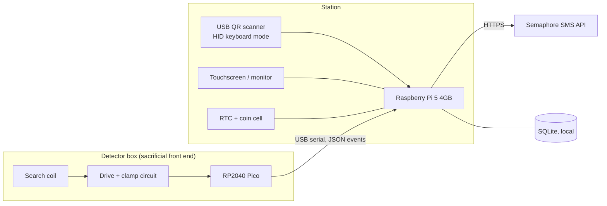

# TRACKIFY — Hardware

Raspberry Pi 5 (4 GB) station, QR input, and the DIY coil-based bag screening box.

---

## 1. Architecture



### Why a microcontroller front end, and not the Pi directly

Two hard constraints make direct connection impossible:

1. **The Pi 5 has no analog input.** There is no ADC on the SoC or the header. Any analog
   measurement needs external conversion.
2. **Linux cannot do microsecond timing.** Pulse-induction measurement needs sampling precision
   in the 10–30 µs range. Linux scheduler jitter is in the *milliseconds* — three orders of
   magnitude too coarse. This is not a matter of writing faster Python; the kernel does not
   offer the guarantee.

So the RP2040 Pico does the real-time work and the Pi does the application work:

| Pico (real-time domain) | Pi 5 (application domain) |
|---|---|
| Coil pulse timing via PIO (~8 ns resolution) | QR scan handling, student lookup |
| Decay measurement and averaging | Attendance and incident records |
| Rolling baseline and drift compensation | Threshold policy, screening gate |
| Threshold comparison | UI, notifications, reporting |
| Emits JSON events over USB serial | Everything a human sees |

There is a third benefit: the Pico sits next to a coil that swings to a few hundred volts on
every pulse. It costs roughly ₱250 and is **sacrificial**. The Pi 5 is not.

> **For the paper:** this separation of real-time sensing from application logic is a legitimate
> architectural contribution and worth stating explicitly in your methodology. It is the reason
> the system can be both responsive and analytically capable on modest hardware.

### Serial protocol

The Pico emits newline-delimited JSON. One event per line, no framing complexity:

```json
{"t":"ready","baseline":41820,"temp_c":31.4}
{"t":"armed","id":"a17f"}
{"t":"reading","id":"a17f","raw":44315,"baseline":41820,"delta":2495,"norm":0.71,"pulses":256,"ms":512}
{"t":"clear","id":"a17f"}
{"t":"error","code":"coil_open"}
```

The Pi treats `norm` (0–1, normalized against the configured full-scale) as the reading
strength stored in `screening_events.reading_strength`. Threshold policy lives on the **Pi**,
not the Pico, so it can be tuned without reflashing.

---

## 2. The box

A rigid enclosure with a flat platform. The bag is placed on the platform; the coil sits
directly beneath it.

```
        ┌─────────────────────────────┐
        │   lid (optional, interlock) │
        ├─────────────────────────────┤
        │                             │
        │      [ bag rests here ]     │   ← non-metallic platform (acrylic / plywood / HDPE)
        │                             │
        ├─────────────────────────────┤
        │  ▓▓▓▓▓ search coil ▓▓▓▓▓▓   │   ← flat spiral, potted / taped down
        ├─────────────────────────────┤
        │  drive board + Pico         │   ← shielded compartment
        └─────────────────────────────┘
              12 V in        USB to Pi
```

**Why the box form factor beats an archway** — worth stating in your paper, because it is a
genuine design advantage and not a compromise:

| | Archway | Bag box |
|---|---|---|
| Person in the EM field | Yes — implant/pacemaker signage and review required | **No.** The field is confined to the enclosure |
| Target-to-coil distance | Varies wildly with gait and bag position | **Fixed.** The single largest sensitivity factor is controlled |
| Body metal (buckles, pocket phone, shoe eyelets) | Triggers constantly | **Excluded entirely** |
| Attribution | Needs a time window; ambiguous with a queue | **Deterministic** — the scan arms the box |
| Baseline stability | Drifts with mechanical flex and traffic | **Stable** — rigid geometry |
| Repeatable measurement for characterization | Poor | **Excellent** — enables a real ROC curve |

**Construction requirements:**

- Platform and enclosure must be **non-metallic** in the coil's field. No metal fasteners,
  hinges, or corner brackets within ~15 cm of the coil. Use nylon/plastic hardware.
- Fixed platform height. Do not make it adjustable — a variable gap destroys your calibration.
- Coil mechanically fixed and potted or firmly taped. Any movement shows up as baseline drift.
- Place the box away from steel shelving, rebar-heavy walls, and electrical panels. Whatever
  environment you calibrate in, keep it there; moving the box invalidates the baseline.
- Optional but recommended: **lid interlock switch** that disables pulsing when the box is
  open. Cheap, and it makes the safety section of your research plan much easier to defend.

---

## 3. Coil

| Parameter | Guidance |
|---|---|
| Form | Flat spiral or rectangular loop matching the platform footprint |
| Size | Roughly the platform area; a smaller coil sees small objects better, a larger one covers more of the bag |
| Wire | 0.4–0.6 mm (≈ 26–24 AWG) enamelled copper |
| Turns | Start ~25 turns and measure; target inductance **200–400 µH** |
| Verification | Measure with an LCR meter, or resonate with a known capacitor and compute from the resonant frequency |

Wind it, measure it, record the actual value — the drive timing in §4 depends on it, and a
coil that measures 180 µH when you assumed 300 µH will draw far more current than intended.

---

## 4. Drive and measurement circuit

### Topology: pulse induction (PI)

Chosen over induction balance because it needs **no coil nulling**. IB requires two coils
positioned so their coupling cancels — the null is fiddly to achieve and drifts with
temperature and mechanical flex. PI uses one coil and no null, which is the right trade for a
build on a deadline.

**Principle:** drive current through the coil, switch it off abruptly, and watch the decay.
Metal in the field sustains eddy currents that **extend the decay**. Longer decay = metal.

### Drive

```
   +12 V
     │
    ┌┴┐
    │ │ search coil L
    └┬┘
     ├──────────┬─────────► measurement tap
    ┌┴┐         │
    │ │ R_d     │
    └┬┘         │
     │          │
     └──────────┤
                │
              ──┴── MOSFET drain
             │  Q1  │  (logic-level N-channel)
              ──┬───
      Pico ──►gate
                │
               GND
```

**Peak current** is set by the pulse width:

```
I_peak = V · t_on / L
```

Pick `t_on` for a target `I_peak` of **1–2 A**. Worked example: at 12 V with L = 300 µH,
targeting 1.5 A gives `t_on = 300µH × 1.5A / 12V ≈ 38 µs`.

**Damping resistor `R_d`** across the coil sets the flyback clamp:

```
V_spike ≈ I_peak · R_d        →  choose R_d such that  I_peak · R_d ≤ 0.7 · V_DS(max)
```

With `I_peak` = 1.5 A and a 400 V MOSFET, `R_d` = 150 Ω gives ≈ 225 V — comfortably inside
the rating. **Verify on a scope before running it continuously.** This is the one measurement
you should not skip; getting it wrong destroys MOSFETs.

**Repetition rate:** ~500 Hz. **Averaging:** 128–256 pulses per reading. At 500 Hz, 256 pulses
is ~0.5 s — well inside the per-bag time budget.

**MOSFET choice:** use a **logic-level** N-channel part (IRL540N, IRLZ44N) so the Pico's 3.3 V
drives the gate directly. A standard IRF740 will *not* fully turn on from 3.3 V — it needs a
gate driver (TC4420 or similar). Getting this wrong causes the MOSFET to run in its linear
region and overheat.

### Measurement — two options

**Option A — comparator + PIO timing (recommended).** Instead of digitizing the decay curve,
measure **time-to-threshold**: feed the clamped coil voltage into a comparator against a fixed
reference, and time the crossing with the Pico's PIO. Metal extends the decay, so the crossing
comes later.

- No ADC, no sample-and-hold, no analog tuning
- PIO gives ~8 ns timing resolution — far more than you need
- Output is a single clean integer per pulse, trivial to average
- Substantially easier to get working and to explain in a paper

**Option B — sample-and-hold + ADC.** Sample the decay at a fixed delay after turn-off and read
with the Pico's onboard ADC. Yields more information about the decay shape (and in principle
some ferrous/non-ferrous discrimination), but needs a fast op-amp, careful timing, and more
analog debugging.

**Start with Option A.** Move to B only if you have working hardware and time to spare.

### Input protection — mandatory

The measurement tap sits on a node that reaches a few hundred volts on every pulse. Between it
and the Pico you need, in order:

1. **Series resistor**, 10–100 kΩ — limits fault current
2. **Clamp to the rails** — Schottky diodes (BAT54S) to 3.3 V and GND, or a 3.3 V zener
3. Then, and only then, the comparator or ADC input

Without this the first pulse destroys the Pico input. Confirm the clamp works with a scope
*before* connecting the Pico.

---

## 5. Raspberry Pi 5 specifics

These will each cost you an afternoon if you find them the hard way.

### GPIO

- **`RPi.GPIO` does not work on the Pi 5.** The Pi 5 routes GPIO through the RP1 southbridge,
  which the old library does not know about. Use **`gpiozero`** with the `lgpio` pin factory,
  or **`libgpiod` v2** directly.
- **Do not hardcode the gpiochip number.** The Pi 5 enumerated as `gpiochip4` on earlier
  Bookworm firmware and `gpiochip0` on later releases. `gpiozero` abstracts this; raw
  `libgpiod` code does not.
- `pinctrl` is the quick CLI for checking pin state on a Pi 5.

In practice the detector needs **none** of this — it connects over USB. GPIO is only relevant
if you add a status LED, buzzer, or the lid interlock.

### Serial

Prefer **USB** for the Pico link. It needs no configuration, survives reboots, and keeps the
noisy detector on a separate physical connector.

If you must use the header UART instead: enable it in `/boot/firmware/config.txt`, disable the
serial *console* (`raspi-config` → Interface → Serial → login shell **no**, hardware **yes**),
and use `/dev/ttyAMA0`. The console being left enabled is the usual reason a UART "does not
work" — the kernel is talking over it.

### Real-time clock

The Pi 5 has a **dedicated RTC and battery connector**. Fit a coin cell.

This is not optional for your use case: after a power cut with no network, a Pi without an RTC
boots with a wrong clock and stamps every attendance record incorrectly. That is silent data
corruption in a study whose entire premise is timestamp accuracy — and it directly addresses
the "data corruption, loss, and system errors" risk in §F of your research plan.

### Power and storage

- Use the **official 27 W USB-C PD supply.** Under-powering a Pi 5 with peripherals attached
  causes throttling and USB dropouts that look exactly like software bugs.
- **Never power the detector from the Pi's 5 V rail.** Separate 12 V supply.
- SD cards wear out under constant small writes. For a 20-day continuous deployment use a good
  A2-rated card or boot from USB SSD, enable **SQLite WAL mode**, and back up daily. Card
  corruption on day 15 would end your data collection.

### QR input

**V1 uses a USB webcam.** The application accepts both a webcam and a USB HID scanner,
and they converge on the same code path, so a scanner can be added later without a code
change. The trade-off is real and worth recording:

| | USB webcam | USB HID scanner |
|---|---|---|
| Read time | Needs framing; a second or two per student | Sub-second, consistent |
| CPU load | ~3 ms per decode at 720p, 10 decodes/sec (measured) | Effectively zero |
| Lighting | Depends on ambient light; glare on lamination is the usual failure | Own illumination |
| Integration | Camera stack, and de-duplication of repeated reads | Appears as a keyboard |
| Morning rush | Likely the bottleneck | Handles it |
| Cost | Often already owned | ₱800–1,500 |

The decode cost is not the problem — 3 ms per frame leaves the Pi 5 almost entirely
idle. **Framing time is.** A student has to hold a card still in front of a lens, where
a scanner reads a card waved past it. For a study of 200 students that difference
compounds at the gate, so budget for a scanner before a full-school deployment.

Three things decide whether a webcam works at all:

| Concern | Requirement |
|---|---|
| **Camera type** | A **USB UVC webcam**, *not* the CSI Camera Module. The ribbon-cable module does not present itself through V4L2 on Bookworm or Trixie since the legacy stack was replaced by libcamera |
| **Printed code size** | **≥ 25 mm wide.** A `TRK-1-3fb640d9` payload is a version-1/2 code of 21–25 modules; below 25 mm it stops resolving at arm's length |
| **Glare** | The most common real-world failure. Use **matte** lamination and angle the camera down ~15° so ceiling lights do not reflect into the lens |

On Linux, QtMultimedia drives the camera through GStreamer. Without
`gstreamer1.0-plugins-base`, `gstreamer1.0-plugins-good` and `gstreamer1.0-libav` the
preview is silently black, which reads as a broken application rather than a missing
package.

**No video frame is ever written to disk.** The preview is live only, and the system
records timestamps rather than images of minors — which is what should be stated in the
study's consent section.

Run `python scripts/check_camera.py` before the kiosk. It separates three failures that
look identical from inside the application: the camera not opening, the code not
decoding, and the code decoding but failing the HMAC check.

---

## 6. Safety

The bag-box form factor removes the largest hazard class before you start: **no person stands
in the field.** The remaining risks are electrical and confined to the enclosure.

| Risk | Mitigation |
|---|---|
| Coil node at 200 V+ | Fully enclosed, no accessible conductors. Lid interlock disables pulsing when open |
| Flyback destroying the MOSFET | `R_d` sized per §4; verified on a scope before continuous operation |
| Front-end damage propagating to the Pi | Pico is the sacrificial boundary; optional USB isolator (ADuM3160) between Pico and Pi |
| Mains hazard | Commercial isolated 12 V SMPS, fused, inside the enclosure. No exposed mains, no home-built mains supply |
| MOSFET thermal runaway | Logic-level part or proper gate driver; heatsink; thermal check after 30 min continuous |
| Coil damage or open circuit | Pico detects out-of-range baseline, emits `error`, Pi disables the screening gate (flow.md §5.9) |
| Interference with medical devices | Field is confined to the enclosure and no person enters it. Post signage anyway; it costs nothing and pre-empts the question |

**Add these to §F of the research plan** — it currently lists only data corruption, privacy,
and generic device malfunction, and does not mention the detector at all. See
[research-plan-review.md](research-plan-review.md), item 7.

---

## 7. Calibration

1. **Empty-box baseline.** With the box empty and the room in its normal state, average 1000+
   readings. Record mean and standard deviation. This is your zero.
2. **Drift compensation.** Re-baseline continuously while idle and unarmed, with a slow rolling
   average. Temperature changes the coil's resistance and therefore the decay; a fixed baseline
   taken at 7 a.m. will be wrong by noon.
3. **Loaded baseline.** Measure typical bags *after* the declaration tray (books, notebooks,
   folders, food containers). This is the distribution you must actually discriminate against —
   not an empty box.
4. **Threshold.** Set from the ROC analysis in §8, not by guessing. Store it on the Pi so it
   can be tuned without reflashing the Pico.
5. **Daily verification.** Before each session, run a known reference object (a fixed steel
   test piece in a fixed position). If it does not read within tolerance, the box is out of
   calibration and screening stays disabled for that session. Log every check — it is
   evidence of instrument control and reviewers look for it.

---

## 8. Test protocol

This is where the box earns its keep scientifically. Fixed geometry makes measurements
**repeatable**, so you can characterize the instrument properly instead of reporting anecdotes.

### 8.1 Object characterization

Full factorial: **objects × positions × repetitions**.

- **Objects:** steel ruler, scissors, kitchen knife, box cutter, multi-tool, plus non-target
  controls (phone, laptop, tablet, coins, metal tumbler, empty bag)
- **Positions:** centre, corner, top of bag, bottom of bag, against the far wall — at minimum 5
- **Repetitions:** ≥ 10 per combination, bag removed and replaced between trials

Record `reading_strength` for every trial. Report mean and standard deviation per cell.

### 8.2 Derived metrics

| Metric | How | Feeds |
|---|---|---|
| Sensitivity (TPR) | Detected targets ÷ total target trials, at chosen threshold | docx Table 2 |
| Specificity (1 − FPR) | Correctly-passed controls ÷ total control trials | docx Table 2 |
| **ROC curve** | Sweep threshold across full range, plot TPR vs FPR | Strongest single result in the study |
| Chosen threshold | Point on the ROC justified by your stated cost of a miss vs a false alarm | Configuration, defensible |
| Repeatability | Coefficient of variation over 30 identical trials | Instrument quality |
| Worst-case position | Cell with lowest detection rate | Honest limitation |

An ROC curve with a justified operating point is a substantially stronger result than "the
detector worked." It also lets you state your detection limits honestly, which reviewers
reward.

### 8.3 Operational metrics

- **Baseline drift** over a full school day, sampled hourly — plot it
- **Latency per bag**, from placement to result
- **Handling time per student**, including tray and bag placement (this is the real throughput
  number, not the electronic latency)

### 8.4 Throughput

At ~8–10 s of handling per student, a single lane screens roughly 360–450 students per hour
**at best**, before queueing effects. Screening every student in a 30-minute entry window is
not achievable with one box.

The resolution is already in your research plan: it specifies **surprise inspections**, so
screen a random sample. Set the selection rate from measured handling time and the entry
window, and **report the rate as a study parameter**. Feeds the *Time Behavior* rows in
docx Tables 3 and 4.

---

## 9. Bill of materials

Prices are rough PH street estimates for budgeting only — verify before purchasing.

| Item | Qty | Est. ₱ |
|---|---|---|
| Raspberry Pi 5, 4 GB | 1 | 4,000–5,000 |
| Official 27 W USB-C PD supply | 1 | 1,000–1,500 |
| microSD A2 64 GB (or USB SSD) | 1 | 500–2,000 |
| Pi 5 RTC coin cell + lead | 1 | 150–300 |
| Touchscreen or monitor | 1 | 2,000–6,000 |
| USB QR scanner, HID mode | 1 | 800–1,500 |
| Raspberry Pi Pico | 1–2 | 250–500 |
| Enamelled copper wire, 0.5 mm, 100 g | 1 | 200–400 |
| Logic-level MOSFET (IRL540N) | 3 | 150 |
| Comparator (LM393 / TLV3501) | 2 | 100 |
| Schottky clamp diodes, resistors, caps | — | 300 |
| Isolated 12 V 2 A SMPS | 1 | 400–700 |
| Enclosure, acrylic/plywood platform, nylon hardware | — | 1,000–2,000 |
| Declaration tray | 1–2 | 200–400 |
| USB isolator ADuM3160 (optional) | 1 | 600–900 |
| **Total** | | **≈ ₱11,000–22,000** |

Excludes SMS credits — see [sms-notifications.md](sms-notifications.md) §4.

---

## 10. Build order

Do not build the whole thing and then debug it. Each step below has a pass/fail you can check.

1. **Pi 5 base** — OS, SQLite, USB QR scanner reading into the app. *Pass: a scan resolves to a
   student on screen.*
2. **RTC** — fit coin cell, pull the power, confirm the clock survives. *Pass: correct time
   after a cold boot with no network.*
3. **Coil** — wind, measure inductance, record it. *Pass: 200–400 µH measured.*
4. **Drive circuit on the bench, no Pico** — scope the flyback, confirm the clamp voltage is
   within the MOSFET rating. *Pass: measured `V_spike` ≤ 0.7 × V_DS.*
5. **Input protection** — verify the clamp holds the measurement tap inside 0–3.3 V. *Pass:
   scoped, before the Pico is ever connected.*
6. **Pico firmware** — pulse, time-to-threshold, average, emit JSON. *Pass: stable readings on
   an empty box, low standard deviation.*
7. **Metal response** — wave a steel object over the coil. *Pass: reading moves clearly and
   returns to baseline.*
8. **Enclosure** — mount everything, re-baseline. *Pass: baseline stable over 1 hour.*
9. **Pi integration** — arm-on-scan, reading bound to the scan, alert on screen. *Pass:
   flow.md §3 end to end.*
10. **Characterization** — run §8. *Pass: an ROC curve and a chosen threshold.*
11. **Pilot** — one section, one week, before the 20-day run. *Pass: no unattributed readings,
    no lost notifications.*
