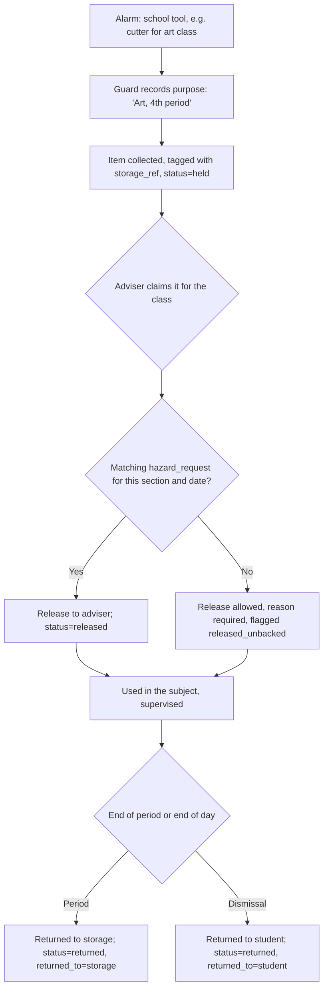

# TRACKIFY — Screening, Prohibited Items, and Custody

How the system records what happens when a student is screened at the gate, what counts as a
prohibited item, and what happens to school tools that are collected.

Companion documents:

| Document | Covers |
|---|---|
| [flow.md](flow.md) | The entry flow this plugs into, and the four governing rules |
| [hardware.md](hardware.md) | The Raspberry Pi station. The DIY coil detector is superseded — see §1 |
| [analytics-model.md](analytics-model.md) | Why incidents are reported descriptively rather than scored |
| [research-plan-review.md](research-plan-review.md) | Corrections needed in the research plan |

---

## 1. What changed, and what it costs

The original design had the school **build** a pulse-induction coil detector: a box, a coil, a
drive circuit, calibration, and a threshold the study would tune. That is superseded. **The
metal detector is now a separate, off-the-shelf device** — a handheld wand or walk-through unit —
operated by a person. TRACKIFY does not read it, is not wired to it, and cannot see its output.

The system's job changes accordingly: from *recording a sensor reading* to **recording what a
person decided.**

### The gain

- The largest hardware risk in the project disappears. No coil winding, no drive circuit, no
  calibration drift, no mains-adjacent safety review.
- [flow.md](flow.md) **Rule 1** — *the sensor never writes to a student record* — becomes true by
  construction. There is no sensor input that could be mistaken for a finding, because every
  value in every table below is a human judgement with a name attached.

### The cost, stated plainly

[hardware.md](hardware.md) §8 called the detector's **ROC curve** *"the strongest single result
in the study."* **That result is gone.** You cannot sweep a detection threshold on a device you
did not build, so sensitivity, specificity, and repeatability stop being findings about your work
and become undisclosed properties of a commercial product.

What the study can still measure is the **procedure**, not the instrument:

| Metric | Definition | Why it survives |
|---|---|---|
| Screening coverage | screened ÷ students who scanned in | The system records who was *not* screened, honestly |
| Alarm rate | alarms ÷ screenings | A property of the device *and* the declaration tray together |
| Confirmation rate | prohibited findings ÷ alarms | The only false-positive measure left. Needs the clears recorded — see §4 |
| Handling time | seconds per student, gate to release | Decides one lane or two. Measured, not assumed |

These are legitimate results. They answer a different question: not *"does this detector work?"*
but ***"does this screening procedure work?"*** The paper must ask the second question, and say
why.

> **Wording that must change.** [research-plan-review.md](research-plan-review.md) item 21 already
> warned that *"automated prohibited-item detection"* overclaimed — the system automated metal
> screening, and a human decided what was prohibited. That warning is now sharper: **the system
> detects nothing at all.** A person sweeps, a person judges, and TRACKIFY records. Any phrasing
> that implies automatic detection is indefensible and is exactly what a judge will probe.

---

## 2. Who is screened

**Every student who scans in.** This reversed an earlier design that specified a random sample,
because the coil box handled one bag at a time at 8–10 seconds each. A handheld detector does
not have that constraint. [flow.md](flow.md) Rule 4 has since been rewritten to match, so the
two documents now agree — but the reversal is recorded here because it changed what the study
reports: there is no selection rate, and incident counts are a census rather than a sample.

Screening everyone makes the **declaration tray mandatory**, not advisory. The arithmetic is not
close:

| | Without the tray | With the tray |
|---|---|---|
| Students who alarm | Nearly all — every phone, every handful of coins | Few |
| Guard action per alarm | Open and inspect the bag, 30 s+ | None |
| 200 students in a 30-minute window | **Impossible** | ~5 s each, one lane, no slack |

Without the tray the guard inspects nearly every bag, learns the alarm means nothing, and starts
waving people through — flow.md's own warning that the system becomes *worse than no system at
all*. With the tray, one lane fits a 200-student intake with **no margin for a queue**.

**Plan for two lanes**, or state an extended entry window as a study parameter and report it.
Measure handling time on the real gate before committing to either ([hardware.md](hardware.md) §8).

---

## 3. The screening outcome

One screening per scan, bound to the arming scan and to nothing else.

| Outcome | Meaning | Writes |
|---|---|---|
| `clear` | No alarm | — |
| `common_items` | Alarm, explained by declared items (phone, laptop, coins, tumbler) | — |
| `prohibited` | Alarm, prohibited item confirmed by inspection | `incidents` |
| `school_hazard` | Alarm, a school tool the student needs for class | `custody_items` |
| `pending_verification` | Inspection started, not finished | — (must resolve) |
| `not_screened` | Nobody screened this student | — |
| `overridden` | Passed without inspection; **reason required** | — |

### `pending_verification` is a state, not a category

The original note listed *"Unidentified metal object — for guard verification"* among the
prohibited-item buttons. It does not belong there. It does not describe an object; it describes an
**unfinished inspection**. As a category it becomes a bucket that quietly accumulates cases nobody
ever resolved, and those cases then appear in the incident counts as though they were findings.

It is an outcome, it must resolve to a real one, and unresolved screenings surface for the guard
the same way unsent SMS already do.

---

## 4. `clear` is data, not a way to dismiss the screen

The natural reading of "safe" is *a button that makes the screen go away*. It is a measurement.

Now that the detector is not ours, the **confirmation rate** — what fraction of alarms turned out
to be a phone — is the only false-positive number the study can still report. That fraction needs
a denominator, and the denominator is every screening that came back clear. Discard them and there
is no result.

This is why `clear` and `common_items` are separate outcomes rather than one "fine" button: the
difference between *no alarm at all* and *an alarm the tray explained* is precisely what measures
whether the declaration tray is doing its job.

---

## 5. Nothing is recorded until a person clicks

**The most important rule in this document.**

The result screen has **no timeout.** It holds on one student until the operator presses a
button, however long that takes.

The first version of this screen closed itself after fifteen seconds and recorded
`not_screened`. That was safer than recording a `clear`, but it was still wrong: the timer fires
while the guard is standing there with the bag open, and the record then says nobody screened a
student who was being screened at that moment.

Removing the timeout makes the guarantee structural rather than careful. **No outcome exists
that a person did not choose.** A fabricated `clear` is not merely avoided by defaulting away
from it — there is no code path that can produce one.

### What that costs: the gate blocks

A scan arriving while a screening is unanswered is **refused**, and the screen says so, naming
the student still waiting.

A refused scan writes **nothing at all** — no `scan_events` row, no attendance, no notification —
so the student simply scans again once the screen is free, and the debounce window does not catch
them either, because there is nothing to debounce against. **The cost is throughput, never a lost
or a wrong record.**

This does mean a distracted operator stops the queue. That is the trade: a gate that visibly
stalls is a problem someone fixes in the next thirty seconds, whereas a gate that quietly
auto-records is a problem nobody finds until the data is analysed.

### The escape hatch, and why it has to exist

Stage 1 keeps an explicit **Not screened** button, set apart from the two main choices.

With no timeout and no auto-supersede, an operator whose detector has gone flat — or who is
waving through a student in a medical emergency — would otherwise have exactly two options:
press a button that fabricates a clear, or leave the kiosk frozen. Neither is acceptable, so
there is a third that is simply true.

An honest `not_screened` costs a line in the coverage statistic. A dishonest `clear` costs the
study its credibility, and the school its defence.

---

## 6. Prohibited-item categories

Five categories, keyed on **what makes the object dangerous** rather than on what it is called.
An object lands in exactly one.

| Code | Label | Covers | Default severity |
|---|---|---|---|
| `bladed` | Bladed object | knife, dagger, razor, box cutter, blade fragment | 4 |
| `blunt` | Blunt or impact object | brass knuckles, hammer, metal pipe or bar | 4 |
| `pointed` | Pointed object, not bladed | ice pick, sharpened rod, awl | 3 |
| `tool` | Tool with a legitimate school use | scissors, cutter, screwdriver, compass | 1 |
| `other` | Other prohibited object | anything not covered above | 2 |

### The decision rule, printed on the guard's screen

> **Has an edge → Bladed. No edge but a point → Pointed. Neither → Blunt.**
> If the item has an ordinary classroom use, choose **Tool**.

### Why not the original list

The categories first proposed were:

```
Prohibited bladed/metal object   ─┐
Dagger or similar                 ├─  a dagger is bladed AND pointed
Razor blade / sharp metal object  ├─  a razor is bladed
Pointed metal object             ─┘
Other prohibited metal object      ←  absorbs anything
Brass-knuckle-type metal object
Hammer or prohibited metal tool
Unidentified metal object          ←  a state, not a category (§3)
```

Five of the eight overlap. Two guards looking at the same folding knife would file it under three
different buttons between them, and [flow.md](flow.md) §4.3 promises an *incident summary
aggregated by category and severity* — a report that means nothing if the categories are not
mutually exclusive. Inter-rater disagreement in a hand-coded instrument is a standard target for
methodological criticism, and this one would have been easy to find.

**Nothing is lost by having fewer buttons.** `incidents.item_description` is **mandatory free
text**: *"folding knife, ~8 cm blade, in side pocket"* is recorded regardless of category. The
category is for counting; the description is for knowing what happened a year later.

### Severity

Defaults come from the category. The guard may raise or lower it — a penknife and a hunting knife
should not score the same — but **a changed severity requires a reason**, recorded on the incident
and written to `audit_log`. An unexplained score is not evidence.

---

## 7. Hazardous school tools: the custody chain

Students legitimately bring cutters, scissors, and compasses for art, TLE, and drafting. Refusing
them is not workable and confiscating them permanently is not fair. The flow, from the original
note:



### The teacher's side

A teacher declares in advance that a section needs particular tools:

> *8-Bonifacio needs cutters for Art on 3 September.*

That declaration (`hazard_requests`) is what makes a release **an expected event rather than a
judgement call at the storage cupboard**. Releasing without one is still permitted — a class
changes, a teacher forgets — but it requires a reason and is flagged `released_unbacked`, because
the request is the control and the exception is the thing worth looking at.

### Why each custody field exists

| Field | Why |
|---|---|
| `storage_ref` | The physical tag or bin number. Without it, `held` does not tell anyone *where the item is*, and a box of forty confiscated cutters is unsearchable |
| `collected_by` · `released_to` · `returned_to` | If an item goes missing, this record is the school's entire account of what happened to it |
| `purpose` | The student's stated reason, captured at the gate while they are standing there — not reconstructed later |
| `released_unbacked` | Separates the controlled path from the exception without blocking the exception |

Every collection, release, and return writes to `audit_log`.

---

## 8. Privacy

An incident record naming a minor and describing a prohibited item is **sensitive personal
information** under RA 10173 (Data Privacy Act of 2012). It is not ordinary attendance data.

- `incidents.visibility` defaults to `restricted` — **guidance and administrators only**. Never
  displayed on the kiosk, which shows only the current student and the current result.
- Custody records concern minors and potentially dangerous objects. Same restriction.
- A retention period must be set and enforced. An incident record should not outlive the
  student's enrolment without a documented reason.

### The guardian SMS must never name the item

```
TRACKIFY: Please contact the school today regarding Lucia (8-Bonifacio).
```

That is the entire message. Not the item, not the category, not the severity.

An SMS is unencrypted, passes through the telco's systems, and — as [flow.md](flow.md) §8 already
warns — a wrong guardian number sends a child's data to a stranger. *"Your child was found
carrying a knife"* arriving on the wrong handset is the single worst privacy failure this system
could produce, and mobile numbers on a school roster are wrong more often than anyone expects.

The detail is delivered by a person, to a verified parent, in the school office.

---

## 9. Why incidents are not weighted, and what they do instead

This section has gone back and forth once already, and the history matters more than usual
here because it bears directly on how the study should describe its own method. In order:

1. **Originally a floor.** Incidents set a minimum band by severity, kept out of the composite
   entirely.
2. **Tried as a fourth weighted criterion**, because the research plan's formula literally
   reads `Risk = w_A·absence + w_T·tardiness + w_E·early_departure + w_I·prohibited_item`. Doing
   that honestly required a pairwise judgement — "prohibited item vs. absence," on Saaty's
   scale — that nobody on the real panel had actually made. One was proposed and picked in a
   working session and saved to `ahp_weights` attributed to the guidance counsellor and
   discipline officer, which is a fabricated number wearing a real person's name.
3. **Reverted to a floor.** Fabricating that judgement was worse than deviating from the
   literal wording of the formula. `ahp.CRITERIA` is three entries again
   (`absence, tardiness, early_departure`); prohibited item is not one of them.

**The formula this codebase implements is therefore three weighted criteria plus a
severity-keyed band floor, not the research plan's literal four-term sum.** State that
plainly in the write-up rather than let a reader assume the formula was followed to the
letter — it is a considered, documented deviation, not an oversight.

### The argument against weighting it

**Don't** restore incidents as an AHP criterion — which is what they were before the metal
detector was deferred to a separate device and `early_departure` took the slot.

Over a ~20-day study you may record **zero, one, or a handful** of incidents (seven, in this
study's data). A criterion with almost no variance contributes noise to the composite risk
score, cannot be validated against anything, and invites the obvious question of how a weight
was derived for something that essentially never happened.

- Keep `early_departure` as the third criterion. n = 3, so the consistency ratio stays
  meaningful — a 2×2 matrix is perfectly consistent by construction and the CR check would be
  vacuous.
- [analytics-model.md](analytics-model.md) §4's logistic feature *"cumulative confirmed
  incidents"* stays **dropped from the absence-prediction model** for the same reason. A
  near-constant-zero predictor is not a predictor, and fitting it then ignoring it is worse than
  not fitting it.

### The arithmetic settles it independently

Even setting the variance argument aside, a weighted term **could not have worked** at any
weight defensible under this formula's own shape. Through the same saturating transform the
other criteria use, one incident maps to

```
1 − exp(−0.25 × 1) = 0.2212          Monitor starts at 0.30
```

so raising a band on a single incident would need a weight of `0.30 / 0.2212 = 1.356`. **The
weights sum to 1.** A student found at the gate with a bladed weapon would still have read
*"Low"* no matter what the panel decided. Pushing the rate up until it fires (ξ ≥ 1.5) turns the
curve into a step function — which is the floor below, with six extra pairwise judgements and a
rewritten methodology section attached.

### What incidents do instead: a floor on the band

A confirmed incident sets a **minimum band**, keyed to severity. It raises a band, never lowers
one, and it does not change the composite.

| Severity | Typical category | Minimum band |
|---|---|---|
| 1 | tool with a legitimate school use | Monitor |
| 2 | other prohibited object | Monitor |
| 3 | pointed, not bladed | Elevated |
| 4 | bladed, or blunt impact | High |

This is a **policy rule, not a statistical estimate** — which is exactly why the objection above
does not apply to it. There is no coefficient to defend, nothing to validate, and no weight
anybody has to justify. The cutoffs live in `config.toml` under `[risk.incident_floor]` and are
the school's to set, like the band boundaries themselves.

The Risk sheet carries the count, the categories, the maximum severity, a descriptive
`Prohibited item I` score (`max_severity / 4`, for context only — it does not feed the composite
or the band), and a **`Band source`** column naming which rule decided the band. Without that
last column a stored *High* against a 0.06 composite reads as an arithmetic error.

- Report incidents **descriptively** in the aggregate: counts by category and severity, and the
  confirmation rate. The Screening sheet stays counts-only — see §8. Per-student detail belongs
  on the Risk sheet, which already names students, and carries the **category and severity but
  never `item_description`**.

---

## 10. Records written

Full definitions in `trackify/core/schema.sql`.

### `screening_events`
`id` · `scan_event_id` · `occurred_at` · `metal_detected` · `outcome` · `declared_items` ·
`override_reason` · `notes` · `operator_id`

> **No `student_id`, deliberately.** Attribution flows only through the arming scan, which makes
> [flow.md](flow.md) Rule 2 structural rather than a convention someone has to remember. The
> sensor columns from the original design — `reading_strength`, `baseline_value`, `threshold` —
> are gone, because there is no reading any more.

### `incidents`
`id` · `student_id` · `screening_event_id` · `occurred_at` · `category` ·
`item_description` **NOT NULL** · `severity` · `severity_reason` · `notes` · `confirmed_by` ·
`visibility`

### `custody_items`
`id` · `student_id` · `screening_event_id` · `item_description` · `category` · `purpose` ·
`storage_ref` · `status` · `collected_at` · `collected_by` · `released_at` · `released_to` ·
`release_reason` · `released_unbacked` · `returned_at` · `returned_to`

### `hazard_requests`
`id` · `section_id` · `date` · `subject` · `item_type` · `notes` · `requested_by` · `created_at`

---

## 11. Where this lives in the software

| Piece | File |
|---|---|
| Taxonomy, outcomes, incident validation | `trackify/core/screening.py` |
| Custody chain and teacher requests | `trackify/core/custody.py` |
| `record_screening`, `record_incident`, coverage | `trackify/core/service.py` |
| Screening keys at the gate | `trackify/ui/kiosk.py` |
| Incident and collection dialogs | `trackify/ui/screening.py` |
| Custody desk | `trackify/ui/custody.py` — `python app.py --custody` |

The gate is **two screens**, and the split is deliberate:

**1. The result screen** — unchanged from an ordinary scan, with one row added. The vast
majority of students have nothing in their bag, so that path stays **one click and no page
change**:

```
 (photo)  Lucia Domingo   8-Bonifacio   IN  7:12 AM
          Tray: phone, laptop, tablet, tumbler, coins
          [ ✓ NO METAL ]   [ ⚠ METAL DETECTED ]      [ ⊘ Not screened ]
```

**2. The bag inspection page** — a full screen, reached only by *Metal detected*:

```
 (◐) Lucia Domingo  8-Bonifacio                              [ ← Back ]

 What was found in the bag?
 Has an edge -> Bladed. No edge but a point -> Pointed. Neither -> Blunt.
 If the item has an ordinary classroom use, choose Tool.

 NOT A CONCERN
 [ ▭ Common items ]  [ ✂ School tool ]

 PROHIBITED
 [ ⌇ Bladed ]  [ ⊤ Blunt ]  [ ↑ Pointed ]  [ ? Other ]

 [ ◷ Inspection not finished ]
```

Three things about that page are load-bearing rather than decorative:

- **The student strip stays across the top.** Classifying a find on a page that does not name
  the student is how one child's knife ends up on another child's record — the worst mistake
  available on this screen, and precisely the risk a separate page introduces.
- **The decision rule from §6 is on this page**, not only in the detail dialog. The dialog is
  reached *after* a category is chosen, one step too late for the rule to help choose it.
- **`Tool` is absent from the prohibited row.** §6 says a tool with an ordinary classroom use
  routes to custody, so **School tool *is* the `tool` category** — showing both would only make
  the operator choose between two buttons that mean the same thing.

Neither screen times out, and a scan arriving before an answer is refused **with the refusal
shown on whichever screen is up** — a message written only to the hidden one would leave the
operator thinking the scanner had died.

### Icons

Drawn as SVG paths in `trackify/ui/icons.py` and rendered through QtSvg, **not emoji and not
image files.** Raspberry Pi OS frequently ships without an emoji font, so a glyph that looks
right on a development laptop renders as an empty box on the deployment machine and nobody finds
out until setup day. A folder of PNGs has the same shape of problem, one careless copy later.
The paths travel with the source and tint to whatever the palette says.

Every screening button is `Qt.NoFocus`. A focused button consumes the Enter that ends a scanner
payload, and one stray click would otherwise stop scanning from working with no visible cause.

---

## 12. Open question

**When does a released item come back?** The design assumes it returns to storage at the end of
the period and to the student at dismissal, and `returned_to` records which. The original note
does not say, and the school's own practice should decide it before the pilot.
